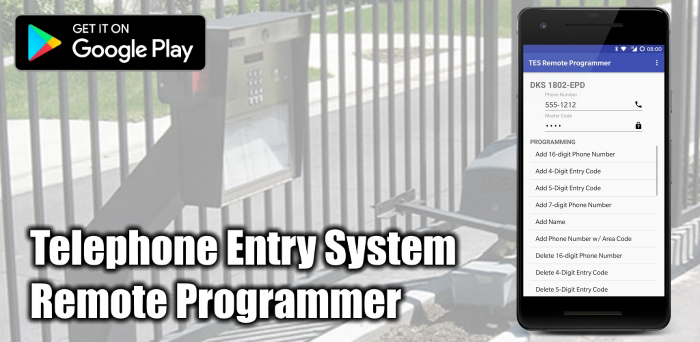
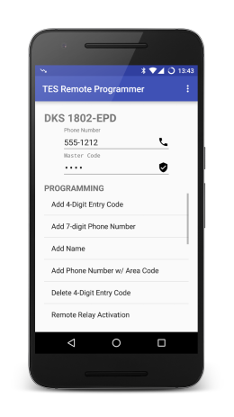
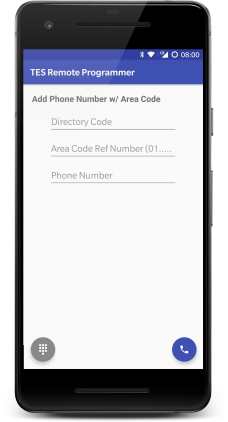
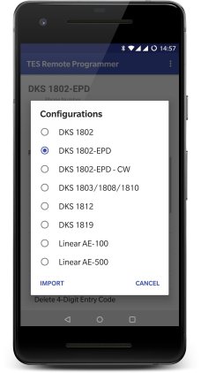
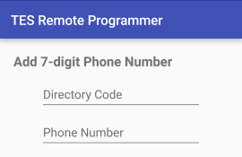

# Telephone Entry System Remote Programmer for Android

[](https://opensource.org/licenses/Apache-2.0)
[](https://travis-ci.org/ethauvin/TESRemoteProgrammer)
[](http://thauv.in/apps-privacy)


](http://mobile.thauvin.net/android/)

Program your Telephone Entry System remotely (off-site) using your phone.

Most Telephone Entry Systems can be programmed from the front keypad or remotely from an off-premise location using any touch-tone phone. TES Remote Programmer streamlines the often cumbersome remote programming process by providing data entry screens and automated dial-in options.

### DoorKing (DKS) & Linear

By default, TES Remote Programmer is configured to work with the [DoorKing 1802, 1802-EPD, 1803, 1808, 1810 and 1819](http://www.doorking.com/telephone/) as well as the [Linear AE-100 and AE-500](http://www.linearproaccess.com/access-controls/telephone-entry-systems/) systems, additional [configurations](#configurations) can be created for most systems supporting remote programming.

### Directory Code

Please note that all default configurations are set for 3-digits directory code length. If your system is setup differently, you will need to modify the [default configuration](app/src/main/res/raw/) and re-import it. Look for all `Directory Code` fields and modify their `size` attributes accordingly.

## Usage



In the main activity screen enter the entry system's phone number and master code, then select one the programming options.



In the programming activity screen fill out the fields and click the  floating button (if available) to dial the programming in or the  floating button to scroll through the manual (keypad) steps.

## Configurations



To switch configuration, choose `Configurations` under the toolbar menu and select the desired configuration.

To import a new configuration, select `Import` in the _Configurations_ dialog.

### New Configurations

Custom configurations can be created using [JSON](http://www.json.org/).

[View Examples](app/src/main/res/raw/)

#### Parameters

Parameters define the configuration's global settings.

```json
"params": {
  "name": "DKS 1802-EPD",
  "type": "dks",
  "ack": "*",
  "alt": "#",
  "end": "0 + #",
  "size": 4
}
```

| Property | Description                                                                                       | Required |
|:---------|:--------------------------------------------------------------------------------------------------|:---------|
|`name`    | The name of the configuration.                                                                    | Yes      |
|`type`    | The system's type, either `dks` or `linear`. See note below.                                      | Yes      |
|`ack`     | The key used to acknowledge or terminate programming steps. Most systems use the `*` or `#` keys. | Yes      |
|`alt`     | They key used to in place of numbers when applicable. DKS systems use the `#` key                 | No       |
|`begin`   | The begin programming manual sequence. (e.g. Linear uses `0` and `2` pressed together)            | No       |
|`end`     | The end programming manual sequence. (e.g. DSK uses `0` and `#` pressed together.)                | No       |
|`size`    | The size (number of digits) of the master code. Most systems use 4 or 6.                          | Yes      |

The `type` is used to determine how letters are converted to digits in alphanumeric (`alpha`) [fields](#fields), both DKS and Linear use different methodologies. It is also used to allow numeric values with leading zeros (e.g. `001`) on DKS systems.

### Options

Options define the data used to create programming activity screens in the app.

For example, the system's manual lists the steps to _Programming 7-digit Phone Numbers_ as:

1. Press *01 and enter Master Code.
2. Enter a Directory Code then press *.
3. Enter a 7-digit Phone Number then press *. If the number is less than 7-digits, enter # in the empty spaces.
4. Press 0# TOGETHER when finished.

which would translate into:



```json
"opts": [
  {
    "title": "Add 7-digit Phone Number",
    "fields": [
      {
        "hint": "Directory Code",
        "size": 3
      },
      {
        "hint": "Phone Number",
        "size": 7,
        "alt": true
      }
    ],
    "dtmf": "*01[MASTER],[FIELD:1]*,[FIELD:2]*"
  }
]
```

Step 4 is configured in the `end` [parameter](#parameters) since it only applies to manual/keypad programming.

| Property | Description                                                                                       |
|:---------|:--------------------------------------------------------------------------------------------------|
|`title`   | The title of the option.                                                                          |
|`fields`  | See [Fields](#fields)                                                                             |
|`dtmf`    | See [DTMF](#dtmf)                                                                                 |
|`nodial`  | Indicate that remote programming is not available. Steps must be executed manually at the keypad. |
|`nosteps` | Indicate that manual/keypad steps are not available. Programming must be executed remotely.       |

All are required, except `nodial` and `nosteps` which are mutually exclusive.

#### Fields

```json
"fields": [
  {
    "hint": "Directory Code",
    "size": 3
  },
  {
    "hint": "Phone Number",
    "size": 7,
    "alt": true
  }
]
```

Fields represent the data entry text fields on option screens.

| Property | Description                                                                                                                                             | Required |
|:---------|:--------------------------------------------------------------------------------------------------------------------------------------------------------|:---------|
|`hint`    | Set the hint/label of the field.                                                                                                                        | Yes      |
|`size`    | Set the size of the field.                                                                                                                              | Yes      |
|`minSize` | Set the minimum size of the field. If set, `size` is the maximum size of the field.                                                                     | No       |
|`alpha`   | Set to `true` for alphanumeric fields.                                                                                                                  | No       |
|`min`     | Set the minimum value of a numeric field.                                                                                                               | No       |
|`max`     | Set the maximum value of a numeric field.                                                                                                               | No       |
|`digits`  | Set digits that are allowed. (e.g. DKS uses `1234567` for days of the week: Sun=1... Sat=7)                                                             | No       |
|`alt`     | Set to `true` if the field accepts the `alt` [parameter](#parameters) value in place of a digit.                                                        | No       |
|`zeros`   | Set to `true` by default when the `type` [parameter](#parameters) is `dks`. Allows numeric values with leading zeros (e.g. `001`), based on the `size`. | No       |


#### DTMF

```json
"dtmf": "*01[MASTER],[FIELD:1]*,[FIELD:2]*"
```

DTMF represent the dialing sequence for the programming steps. A comma (`,`) should be used to specify a pause in the dialing sequence.

The following markers will be substituted by their actual values upon dialing.

| Marker     | Description                                                                               |
|:-----------|:------------------------------------------------------------------------------------------|
|`[MASTER]`  | Substituted with the Master Code                                                          |
|`[FIELD:X]` | Substituted with the field's value, where X is the field number in the array.             |
|`'Foo bar'` | Displays the enclosed text as a manual step. The `nodial` [option](#options) must be set. |

#### Validation

Imported configurations will be validated. While the validation is not perfect, it should be good enough to spot most syntax errors.

Please sure to use a JSON editor to make creating configurations a whole lot easier.

When in doubt be sure to look at the [default configurations](app/src/main/res/raw/).
