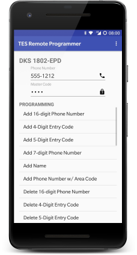

# Telephone Entry System Remote Programmer for Android

[](https://opensource.org/licenses/Apache-2.0)

[](http://mobile.thauvin.net/android/)

Program your Telephone Entry System remotely (off-site) using your phone.

Most Telephone Entry Systems can be programmed from the front keypad, or remotely from an off-premise location using any touch-tone phone. TES Remote Programmer streamlines the often cumbersome remote programming process by providing data entry screens and automated dial-in options.

By default, TES Remote Programmer is configured to work with the [DoorKing (DKS) 1802-EPD](http://www.doorking.com/telephone/1802-entry-system) system, additional configurations can be created and imported for most systems supporting remote programming.

## Usage



In the main activity screen enter the entry system's phone number and master code, then select one the programming options.


In the programming activity screen fill out the fields and click the  floating button (if available) to dial the programming in or the  floating button to scroll through the manual (keypad) steps.

## Configurations


To switch configuration, choose `Configurations` under the toolbar menu and select the desired configured.

To import a new configuration, select `Import` in the _Configurations_ dialog.

### New Configurations

Custom configurations can be created using [JSON](http://www.json.org/). 

[View Example](app/src/main/res/raw/dks_1802_epd.json)

#### Parameters

First defined the global parameters:

```json
"params": {
  "name": "DKS 1802-EPD",
  "star": "*",
  "hash": "#",
  "end": "0 + #",
  "size": 4
}
```

| Parameter  | Description                                                                                      | Required |
|:-----------|:-------------------------------------------------------------------------------------------------|:---------|
|`name`      | The configuration name.                                                                          | Yes      |
|`star`      | The key used to start, acknowledge or terminate programming steps. Most systems use the `*` key. | Yes      |
|`hash`      | They key used to in place of numbers when applicable. Most system use the `#` key                | No       |
|`end`       | The end programming manual sequence. For example DoorKing uses `0` and `#` pressed together.     | No       |
|`size`      | The size (number of digits) of the master code. Most systems use 4 or 5.                         | Yes      |

### Options

Second defined options. These defined the data used to create programming activity screens in the app.

For example, the system's manual would list the steps to Programming 7-digit Phone Numbers as something like:

1. Press *01 and enter Master Code.
2. Enter a Directory Code then press *.
3. Enter a 7-digit Phone Number then press *.
4. Press 0# TOGETHER when finished.

which would translate into:

```json
"opts": [
  {
    "title": "Add 7-digit Phone Number",
    "fields": [
      {
        "hint": "Directory Code",
        "size": 3
      },
      {
        "hint": "Phone Number",
        "size": 7,
        "hash": true
      }
    ],
    "dtmf": "*01[MASTER],[FIELD:1]*,[FIELD:2]*"
}
```

| Elements | Description                                                                              |
|:---------|:-----------------------------------------------------------------------------------------|
|`title`   | The title of the option.                                                                 |
|`fields'  | See [fields](#fields)                                                                    |
|`dtmf`    | See [DTMF](#dtmf)                                                                        |
|`nodial`  | Indicated the remote programming is not available. Steps must be executed at the keypad. |

All are required, except `nodial`

#### Fields

```json
"fields": [
  {
    "hint": "Directory Code",
    "size": 3
  },
  {
    "hint": "Phone Number",
    "size": 7,
    "hash": true
  }
]
```

Fields represent the data entry text field on option screens.

| Element | Description                                                                           | Required |
|:--------|:--------------------------------------------------------------------------------------|:---------|
|`hint`   | Set the hint/label of the field.                                                      | Yes      |
|`size`   | Set the required size of the field.                                                   | Yes      |
|`min`    | Set the minimum value of a numeric field.                                             | No       |
|`max`    | Set the maximum value of a numeric field.                                             | No       |
|`alpha`  | Set to `true` if the field is alphanumeric.                                           | No       |
|`hash`   | Set to `true` if the field accept the (#Parameters) `hash` value in place of a digit. | No       |


#### DTMF

```json
"dtmf": "*01[MASTER],[FIELD:1]*,[FIELD:2]*"
```

DTMF represent the dialing sequence for the programming steps. A comma (`,`) can be used to specify a pause in the dialing sequence.

The following markers will be substituted by their actual values upon dialing.

| Marker     | Description                                                                   |
|:-----------|:------------------------------------------------------------------------------|
|`[MASTER]`  | Substituted with the Master Code                                              |
|`[FIELD:X]` | Substituted with the field's value, where X is the field number in the array. |

#### Validation

Imported configurations will be validated. While the validation is not perfect, it should be good enough to spot most syntax errors.

Please sure to use a JSON editor to make the whole process of creating configurations a whole lot easier.

When in doubt be sure to look at the [default configuration](app/src/main/res/raw/dks_1802_epd.json).


